# yaetunes

yaetunes は、様々なアーティストの楽曲を簡単に試聴できる音楽試聴サイトです。
このアプリケーションでは、配信されている楽曲や新着チャートの検索、試聴を行うことができます。
ユーザーはアカウント機能やマイページ機能を活用して、お気に入り楽曲の設定やプレイリストの作成、
再生履歴を確認できます。


## 概要

- **内容**: 楽曲を試聴できるアプリケーション
- **機能**: 楽曲試聴、新着、人気チャート確認、特集プレイリストの確認、楽曲検索機能、お気に入り楽曲/アーティストの管理、プレイリストの作成及び管理、再生履歴の確認、アカウント管理、マイページ機能
- **対象**: 楽曲に興味のある方々
- **技術スタック**: Next.js, TypeScript, JWT, bcrypt, deezer API, prisma, postgresql

## 機能一覧

| 機能             | 説明                                                                                           |
| ---------------- | ---------------------------------------------------------------------------------------------- |
| アカウント管理   | ユーザーは新規アカウント作成、ログイン、ログアウト、編集、退会ができます。                     |
| 楽曲試聴         | 楽曲を 30 秒に限り試聴できます。                                                               |
| マイページ       | お気に入り楽曲/アーティスト、プレイリストと再生履歴の確認ができます。                          |
| 検索機能         | 検索結果を楽曲、アーティスト、アルバム単位で表示します。                                       |
| お気に入り機能   | 楽曲もしくはアーティストをお気に入り登録して後から確認できます。未ログイン時は利用できません。 |
| プレイリスト機能 | プレイリストを作成し、楽曲を追加して後から試聴できます。未ログイン時は利用できません。         |

## インストール方法

このアプリケーションをローカル環境で動作させるための手順です。

### 前提条件

- Node.js
- yarn

### 手順

1. リポジトリをクローンします。

```bash
git clone git@github.com:y4edd/sonic-journey.git
```

2. 必要なパッケージをインストールします。

```bash
cd sonic-journey
yarn install
```

3. DB をマイグレーションします。

```bash
yarn prisma db push
```

4. DB に必要な情報をインポートします。Seed ファイル(/prisma/sql/picksInsert.sql, /prisma/sql/pickSongInsert.sql)を順に実行します。

5. 開発サーバーを起動します。

```bash
yarn dev
```

6. ブラウザで`http://localhost:3000`にアクセスします。

## 使用方法

<table>
  <tr>
    <th>アカウント登録 /user/register/</th>
    <th>ログイン画面 /user/login</th>
  </tr>
  <tr>
    <td>
      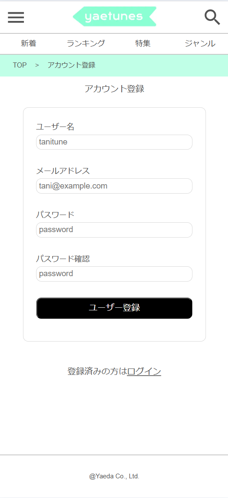
    </td>
    <td>
      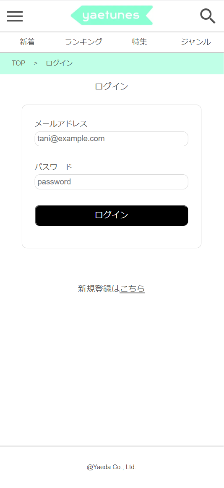
    </td>
  </tr>
  <tr>
    <td>アカウント名とメールアドレス、パスワードを登録できます。</td>
    <td>メールアドレスとパスワードでの認証機能を実装しました。</td>
  </tr>
  <tr>
    <th>アカウント編集 /user/:id/edit</th>
    <th>アカウント詳細、退会、ログアウト /user/:id/info</th>
  </tr>
  <tr>
    <td>
      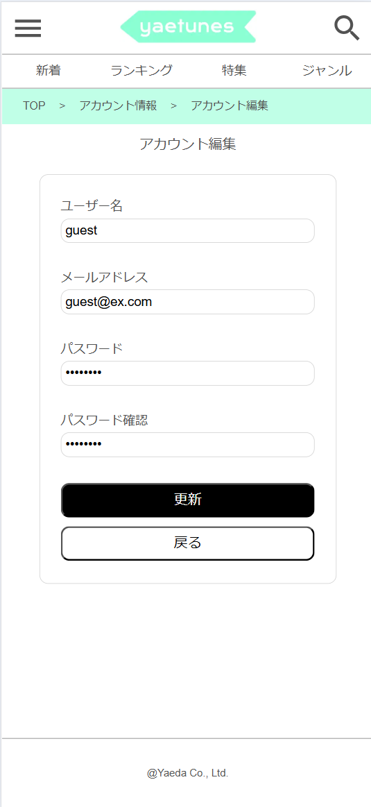
    </td>
    <td>
      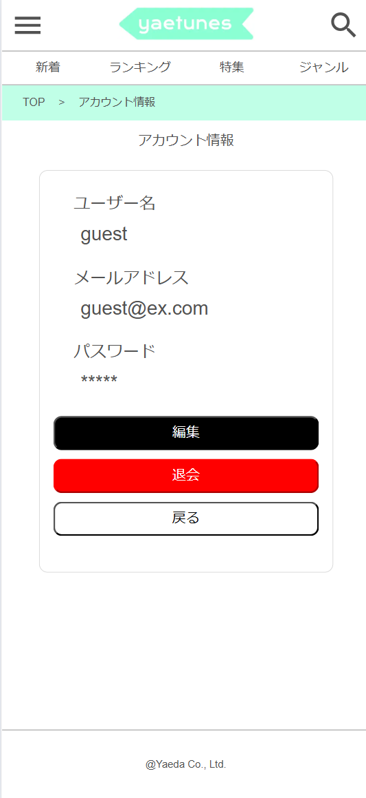
    </td>
  </tr>
  <tr>
    <td>アカウント名、メールアドレス、パスワードを編集できます。</td>
    <td>アカウント情報の確認、ログアウト、退会ができます。</td>
  </tr>
  <tr>
    <th>トップページ /</th>
    <th>楽曲詳細画面 /music/:id</th>
  </tr>
  <tr>
    <td>
      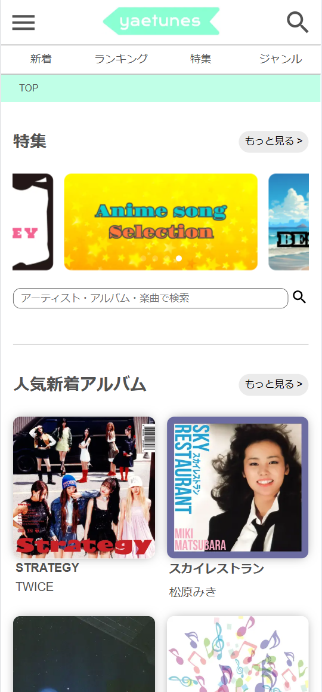
    </td>
    <td>
      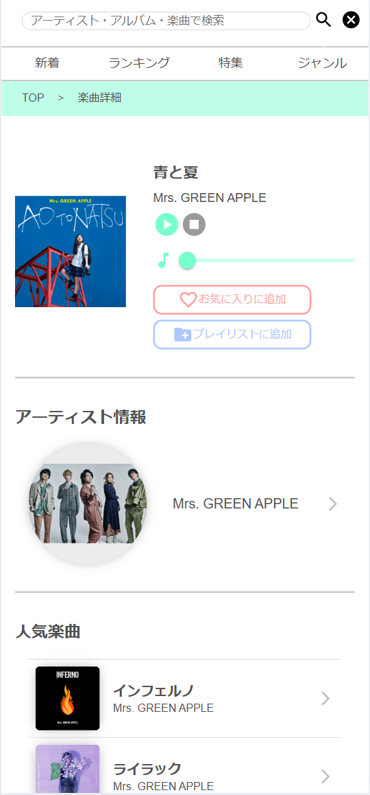
    </td>
  </tr>
  <tr>
    <td>人気チャートや新着チャートを確認できます。<br />
    特集ページやジャンル別のアーティスト検索ページへアクセスできます。<br />
    検索ワードを入力して楽曲やアーティストを検索できます。</td>
    <td>楽曲の詳細を確認できます。楽曲の試聴、お気に入り、プレイリストへの
    追加ができます。また、楽曲が収録されているアルバムやアーティスト
    及びアーティストの人気楽曲を確認し、各詳細ページへアクセスできます。</td>
  </tr>
  <tr>
    <th>アルバム詳細画面 /album/:id</th>
    <th>アーティスト詳細画面 /artist/:id</th>
  </tr>
  <tr>
    <td>
      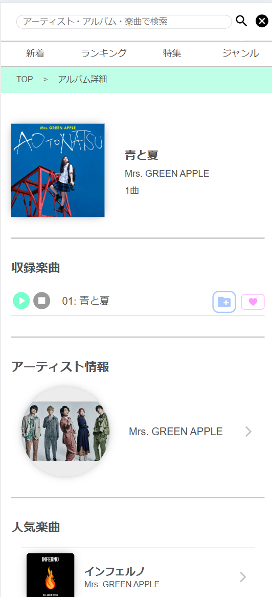
    </td>
    <td>
      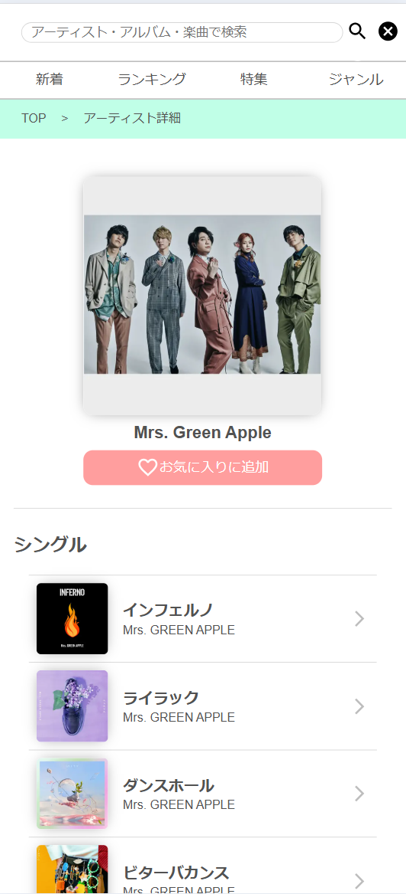
    </td>　
  </tr>
  <tr>
    <td>アルバムの詳細を確認できます。アルバムに収録されている楽曲毎に
    試聴、お気に入り、プレイリストへの追加ができます。<br />
    また、楽曲やアーティスト及びアーティストの人気楽曲を確認し、
    各詳細ページへアクセスできます。</td>
    <td>アーティストの詳細を確認できます。お気に入りへの追加ができます。<br />
    アーティストの人気楽曲や人気アルバムを確認し、各詳細ページへアクセスできます。</td>
  </tr>
  <tr>
    <th>検索結果画面 /search</th>
    <th>新着チャート画面 /newarrival</th>
  </tr>
  <tr>
    <td>
    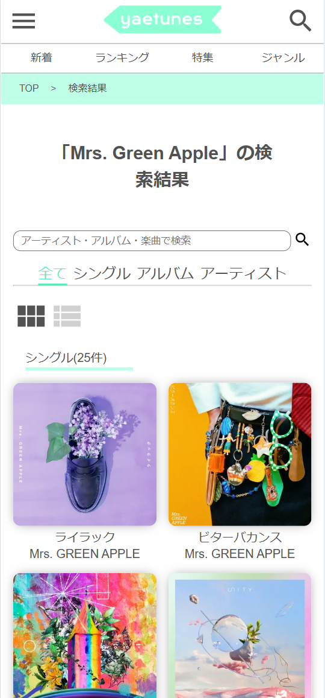
    </td>
    <td>      
    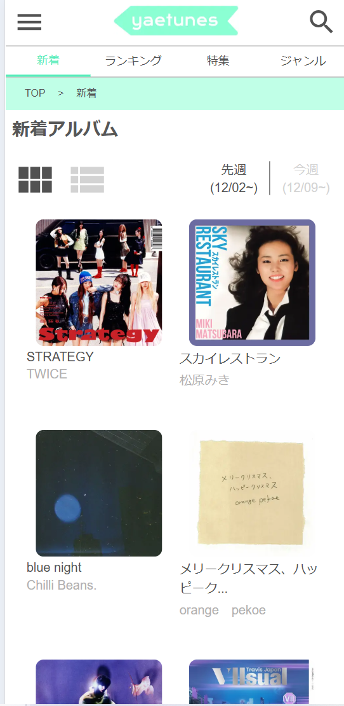
    </td>

  </tr>
  <tr>
    <td>検索ワードに沿った検索結果を確認できます。検索結果は
    シングル曲、アルバム、アーティストのそれぞれ最大25件表示されます。</td>
    <td>2週間以内に配信が開始されたアルバムを確認できます。アルバム詳細画面へアクセスできます。</td>
  </tr>
  <tr>
    <th>ランキングチャート画面 /ranking</th>
    <th>特集選択画面 /special</th>
  </tr>
  <tr>
    <td>
    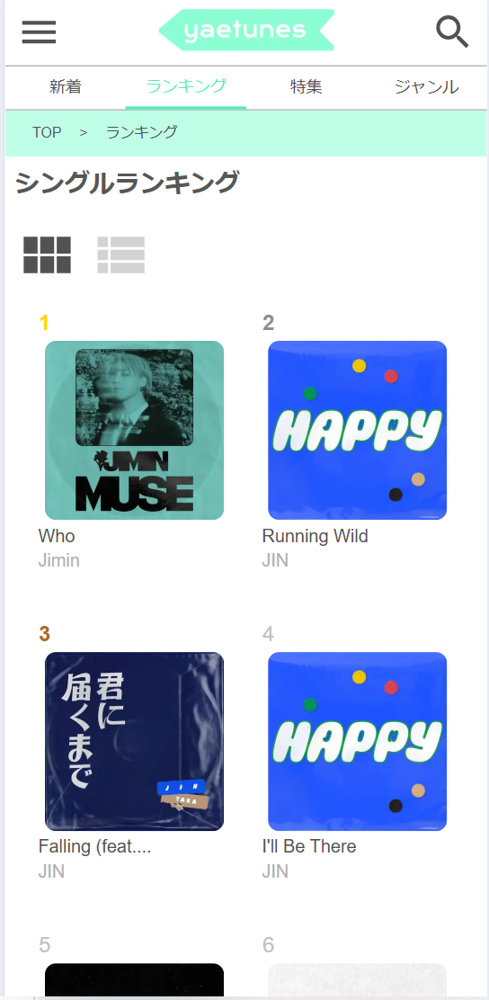
    </td>
    <td>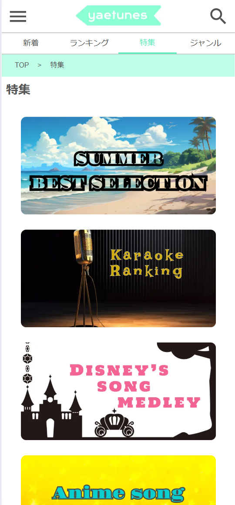
    </td>
  </tr>
  <tr>
    <td>シングルアルバムのランキングを確認できます。楽曲詳細画面へアクセスできます。</td>
    <td>各楽曲特集のサムネイルを確認し、選択できます。</td>
  </tr>
  <tr>
    <th>特集画面 /special/:id</th>
    <th>ジャンル別アーティスト確認画面 /genre</th>
  </tr>
  <tr>
    <td>
    
    </td>
    <td>
    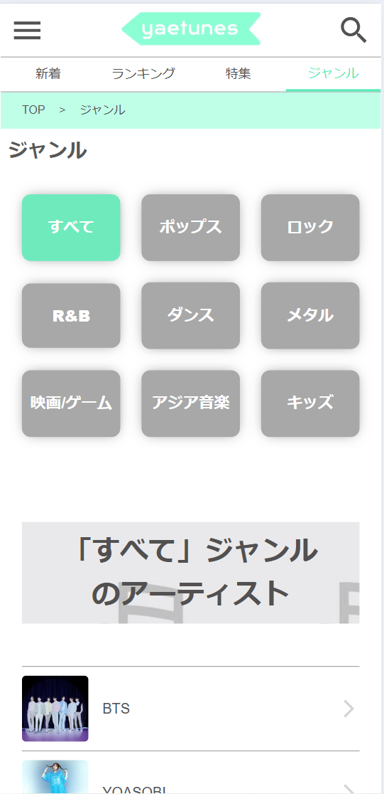
    </td>
  </tr>
  <tr>
    <td>楽曲特集を確認できます。特集に収録されている楽曲毎に
    試聴、お気に入り登録ができます。</td>
    <td>ジャンル毎にアーティストを確認できます。</td>
  </tr>
  <tr>
    <th>プレイリスト選択画面 /mypage/playlist</th>
    <th>プレイリスト作成画面 /mypage/playlist</th>
  </tr>
  <tr>
    <td>
    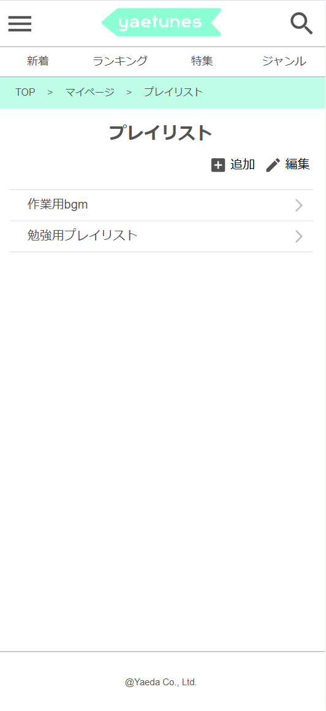
    </td>
    <td>
    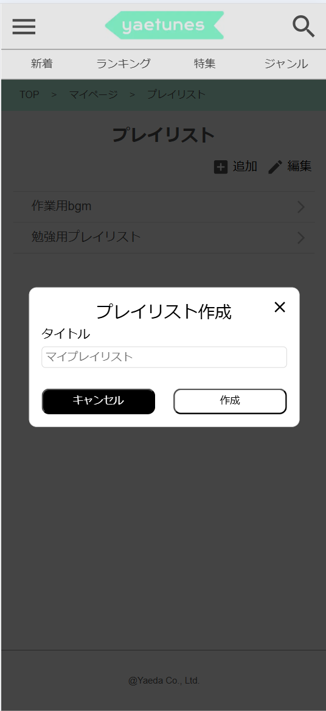
    </td>
  </tr>
  <tr>
    <td>作成したプレイリストを確認できます。<br />
    また、プレイリストの作成、編集画面へアクセスできます。</td>
    <td>タイトルを入力し、作成ボタンを押すことでプレイリストを作成できます。</td>
  </tr>
  <tr>
    <th>プレイリスト編集画面 /mypage/playlist</th>
    <th>プレイリスト詳細画面 /mypage/playlist/:id</th>
  </tr>
  <tr>
    <td>
    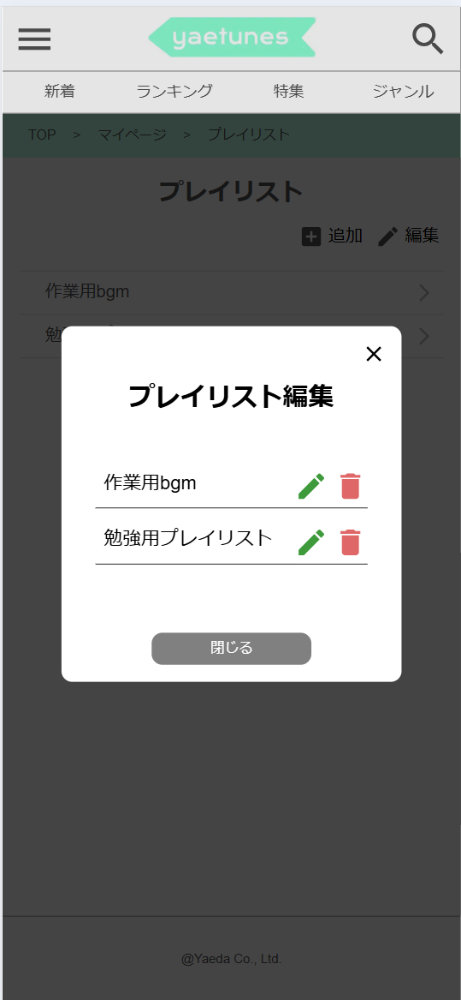
    </td>
    <td>
    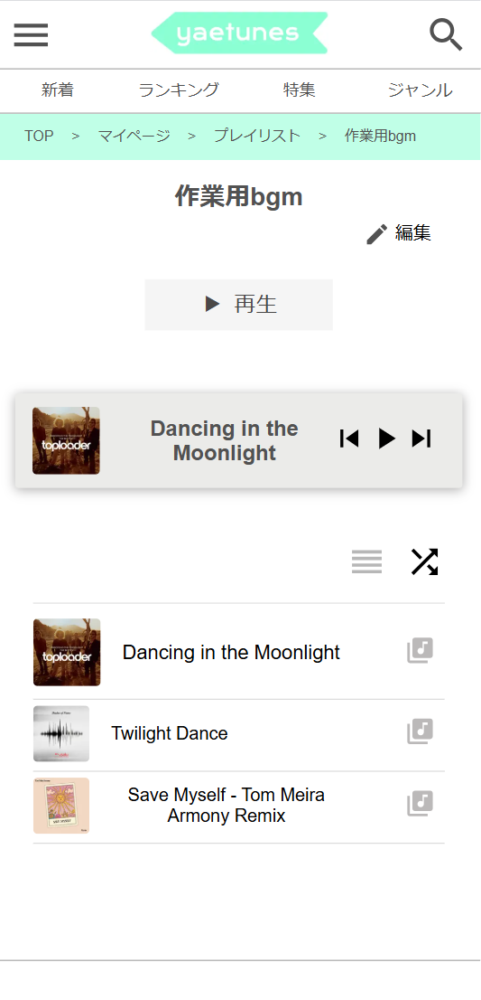
    </td>
  </tr>
  <tr>
    <td>既存のプレイリストのタイトルを変更できます。<br />
    また、プレイリストを削除できます。</td>
    <td>プレイリストに追加した楽曲を確認できます。また、追加した楽曲を
    通常再生/シャッフル再生できます。リスト表示されている楽曲を押下することで任意の楽曲から
    再生を開始できます。また、楽曲詳細ページへアクセスできます。<br />
    プレイリストの収録楽曲の編集ページへアクセスできます。</td>
  </tr>
  <tr>
    <th>プレイリスト詳細編集画面 /mypage/playlist/:id</th>
    <th>お気に入りアーティスト画面 /mypage/favoriteartist</th>
  </tr>
  <tr>
    <td>
    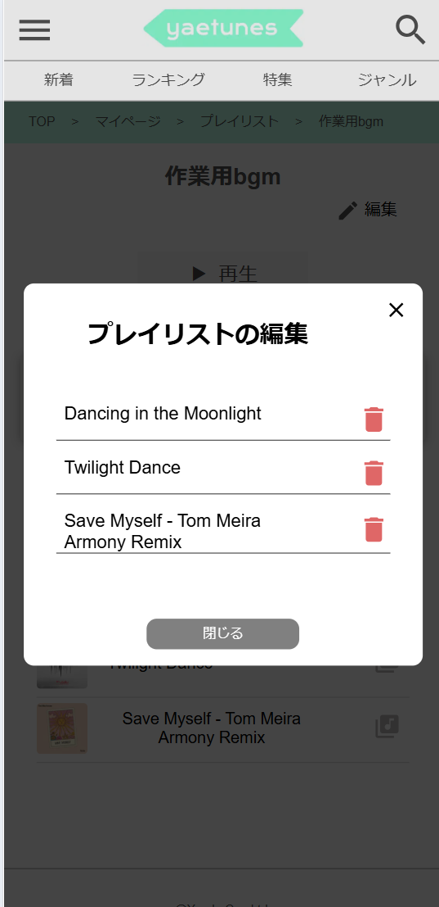
    </td>
    <td>
    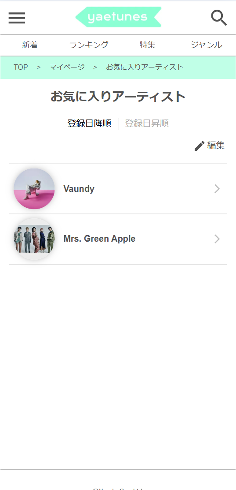
    </td>
  </tr>
  <tr>
    <td>プレイリストに追加した楽曲を削除できます。</td>
    <td>お気に入りに追加したアーティストを一覧で確認できます。</td>
  </tr>
  <tr>
    <th>お気に入り楽曲画面 /mypage/favoritemusic</th>
    <th>再生履歴画面 /mypage/history</th>
  </tr>
  <tr>
    <td>
    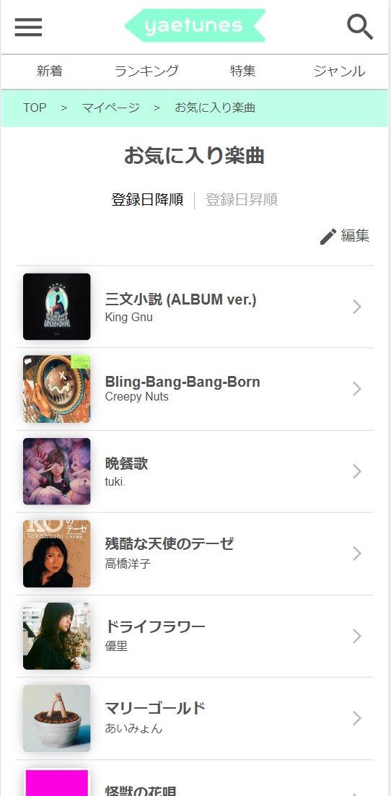
    </td>
    <td>
    
    </td>
  </tr>
  <tr>
    <td>お気に入りに追加した楽曲を一覧で確認できます。</td>
    <td>再生履歴を最大10件で確認できます。</td>
  </tr>
</table>
