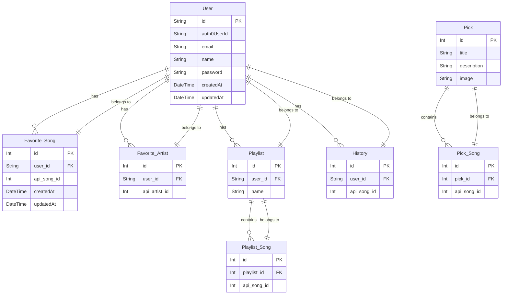

# ER図

```mermaid
erDiagram
    User {
        String id PK
        String auth0UserId
        String email
        String name
        String password
        DateTime createdAt
        DateTime updatedAt
    }
    Favorite_Song {
        Int id PK
        String user_id FK
        Int api_song_id
        DateTime createdAt
        DateTime updatedAt
    }
    Favorite_Artist {
        Int id PK
        String user_id FK
        Int api_artist_id
    }
    Playlist {
        Int id PK
        String user_id FK
        String name
    }
    Playlist_Song {
        Int id PK
        Int playlist_id FK
        Int api_song_id
    }
    History {
        Int id PK
        String user_id FK
        Int api_song_id
    }
    Pick {
        Int id PK
        String title
        String description
        String image
    }
    Pick_Song {
        Int id PK
        Int pick_id FK
        Int api_song_id
    }

    User ||--o{ Favorite_Song : "has"
    User ||--o{ Favorite_Artist : "has"
    User ||--o{ Playlist : "has"
    User ||--o{ History : "has"
    Playlist ||--o{ Playlist_Song : "contains"
    Pick ||--o{ Pick_Song : "contains"
    Favorite_Song ||--|| User : "belongs to"
    Favorite_Artist ||--|| User : "belongs to"
    Playlist ||--|| User : "belongs to"
    Playlist_Song ||--|| Playlist : "belongs to"
    History ||--|| User : "belongs to"
    Pick_Song ||--|| Pick : "belongs to"
```
